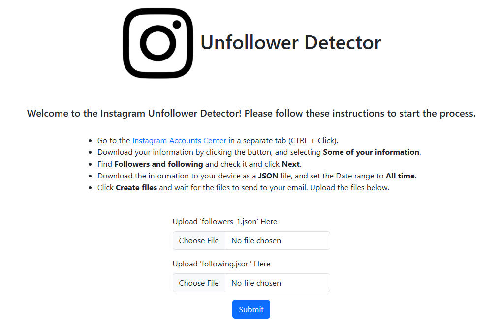

# Instagram Unfollower Detector

## Overview
The **Instagram Unfollower Detector** is a web application that helps users identify which Instagram accounts are no longer following them back. It leverages data exported from Instagram's Accounts Center and processes it to generate actionable insights.

## Features
- User-friendly interface with clear instructions for uploading necessary files.
- Supports JSON files exported from Instagram's Accounts Center.
- Processes "followers" and "following" data to determine mismatches.

## Usage
1. Navigate to the [Instagram Accounts Center](https://accountscenter.instagram.com/info_and_permissions/dyi/).
2. Export your account data:
   - Select **Some of your information**.
   - Choose **Followers and following**.
   - Set the date range to **All time** and request the data in **JSON** format.
3. Download the data sent to your email.
4. Visit the [Instagram Unfollower Detector](https://instagram-unfollower-detector.onrender.com/).
5. Upload the `followers_1.json` and `following.json` files on the website.
6. View the generated list of unfollowers.

## File Details
### app.py
- The Flask backend serving the application.
- Renders the HTML template and manages user interaction.

### index.html
- The main frontend page containing instructions and file upload forms.
- Leverages Bootstrap for styling.

### styles.css
- Custom CSS for enhancing the UI.
- Styles components like title, description, and file upload forms.

## Dependencies
- [Bootstrap](https://getbootstrap.com/): For responsive and modern UI design.

## Future Plans
- **User Authentication:** Allow users to log into their accounts and eliminate the download / upload system altogether.
- **Advanced Filtering:** Allow users to filter unfollowers by their follower count so influencers and celebrities are not displayed.
- **Enhanced Data Visualization:** Display unfollowers in a better format, perhaps allowing the user to click their names to directly unfollow.
- **Mobile App Integration:** Develop a mobile-friendly version for quick access.

## Screenshots
### Home Page

## Contributions
Feel free to submit pull requests for improvements, bug fixes, or additional features.

## License
This project is licensed under the MIT License.

## Acknowledgments
- Instagram for their data export feature.
- Bootstrap for the CSS framework.

---
Enjoy using the Instagram Unfollower Detector to manage your Instagram connections!
